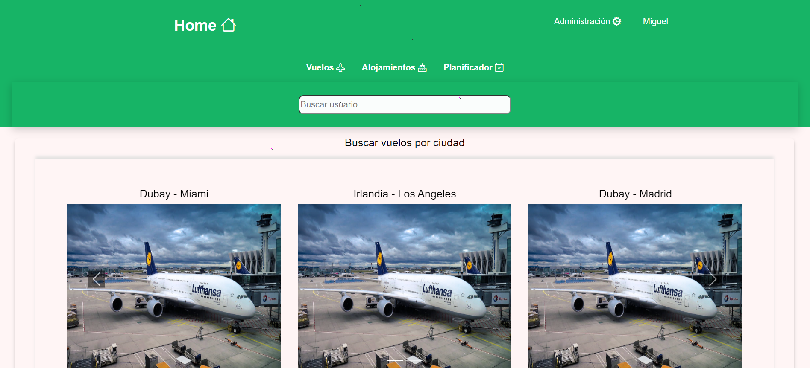
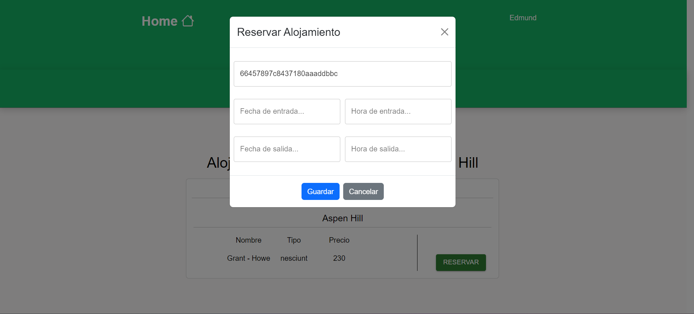

---
## Vista de la Aplicación

---

<ul>

<ul>

<li><a href="#tecnologías">Tecnologías</a> </li>

<li><a href="#descripción">Descripción</a> </li>

<li> <a href="#estructura-y-diseño-de-la-base-de-datos">Estructura y diseño de la base de datos</a> </li>

<li> <a href="#sobreelproyecto">Sobre el proyecto </a> </li>
<li> <a href="#author">Author</a> </li>

</ul>

</ul>

---

## Tecnologías

---
## Descripción
El siguiente proyecto se desarrolla un sistema web de planificación de viaje. Un sistema donde los usarios pondrán cadastrarse y hacer sus reservas, y hacer la gestión de sus datos de información.

---
Sobre las funcionalidades del usuario en esta primera etapa es:

Usuarios
- Registrarse y loguearse
- Hacer reservas de vuelos y alojamientos
- Visualizar su perfil y sus reservas
- Visualizar todos los servicios que ofrese el sistema
- Eliminar sus reservas de su perfil
- Salvar sus reservas descargando un documento pdf

Super Admin
- Listar usuarios, registrar, actualizar, eliminar
- Listar vuelos, adicionar, actualizar, eliminar
- Listar alojamientos, adicionar, actualizar, eliminar
- Listar reservas de alojamientos, actualizar, eliminar
- Listar reservas de vuelos, eliminar

---
## Estructura y diseño de la base de datos

---

- Vista perfil de Usuario

---

- Vista destinos de vuelos
En esta vista se visualisa todos los vuelos que tienen el mismo destido

---

- Vista detallel de vuelo y pago del pasagen
Aquí se visualiza la información del vuelo y en esta misma vista el usuario podrá hacer el pago de pasajen

---

- Vista reserva de alojamientos
En esta vista el usuario podrá hacer la reserva de alojamiento

---

- Vista de gestión de Usuario
Esta es una vista administractiva, en esta vista el super administrador prodrá visualizar todos los usuarios del sistema

---

## Sobre el proyecto

El proyecto se encuentra en una fase de construcción, ya que como un proyecto real de gestión de planificación de viajens hace falta diversas fucionalidades que brindan servicios al usuario. El proyecto estará siendo actualizado constantemente, ya que para la segunda fase se necesita crear un mapa de planes para los usuarios del sistema.

---
## Author:

Name: Miguel Bengui
